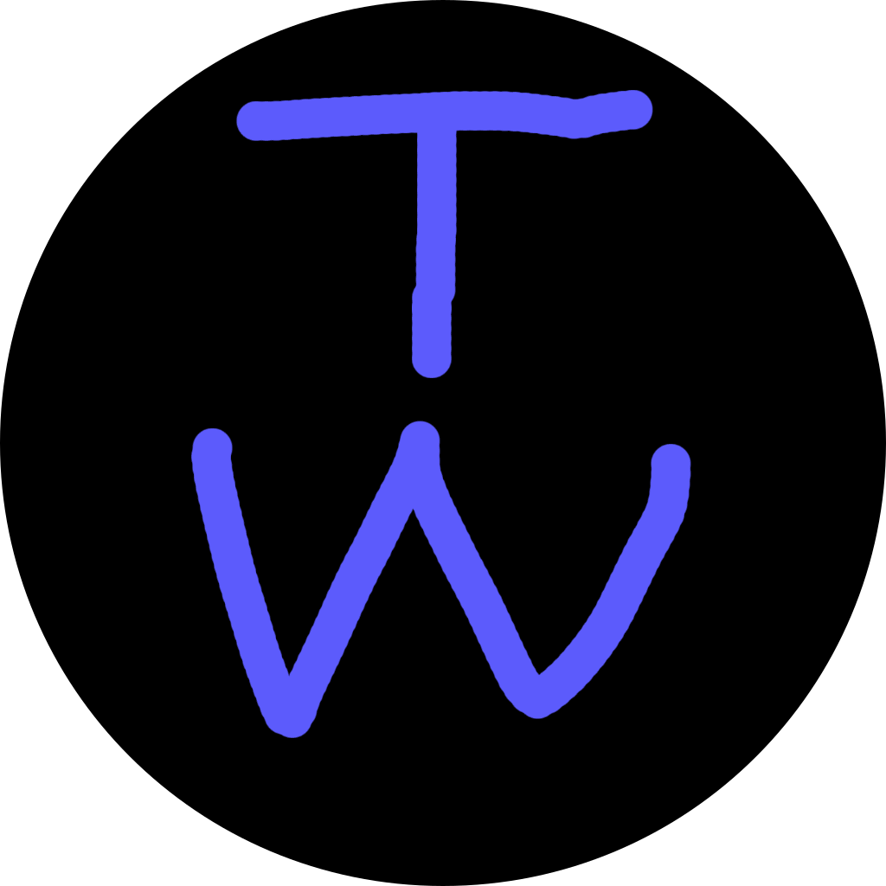

    
      
    <h1>Terriblepedia</h1>
    The worst wiki site ever. (for the Website War 2025, a competition between me and my friends)
     
    You can create an article by just copying a file from the articles directory and submitting a pull request.

